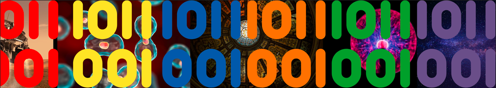

  

### Hola 👋

<h1 align="center">Hello 👋, I'm Berenice Ramos</h1>
<h3 align="center">A passionate data scientist</h3>

- 🌱 I’m currently learning **Math**

- 👯 I’m looking to collaborate on [RedPulse AI](https://github.com/JozueDev/PROYECTO-FINAL/tree/main)

- 📫 How to reach me **berenice.programmer3@gmail.com**

- ⚡ Fun fact **I am very very curious person**

<h3 align="left">Connect with me:</h3>

<h3 align="left">Languages and Tools:</h3>

                 

